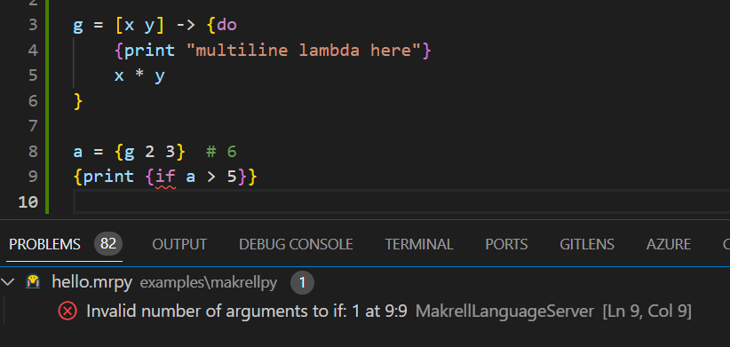

# Makrell Language Support for Visual Studio Code

This extension adds Makrell family language support to VS Code.

Current scope:

- Makrell / MakrellPy / MakrellTS / Makrell#
- MRON
- MRML
- MRTD

Current features:

* Syntax highlighting
* Code snippets
* Start a Makrell REPL and send code to it
* Connect to the Makrell language server and get basic diagnostics

Current file support:

- `.mr`
- `.mrx`
- `.mrpy`
- `.mrts`
- `.mrsh`
- `.mron`
- `.mrml`
- `.mrtd`



The current REPL / language-server integration still assumes the Python-based
Makrell tooling is installed.

Install it with:

```bash
pip install makrell
```

This extension is part of the Makrell monorepo:

- repo: <https://github.com/hcholm/makrell-omni>
- site: <https://makrell.dev/>
